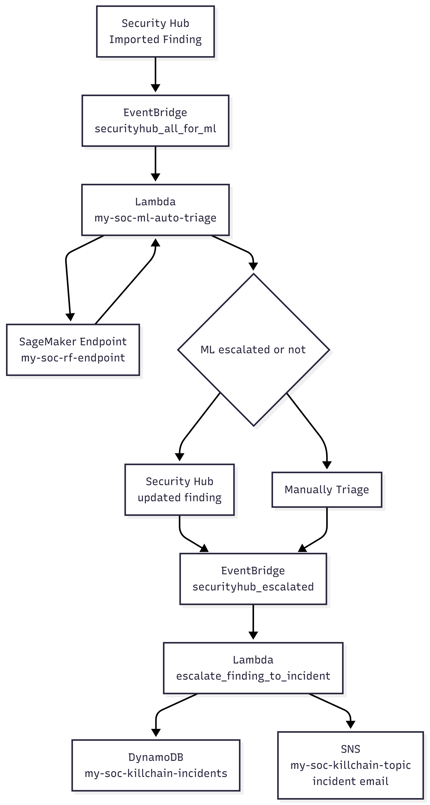

# my-soc: Terraform SOC (Threat Model → Detection → Response → Automation/MITRE/ML → CloudGoat) 

> Goal: Show pipeline **Threat Model → Detection → Response → ML** on AWS using Terraform, native security services, and a small SageMaker model.

This repo defines a small **SOC** in AWS:

- **Assets**: 1 Application Load Balancer + 2 web servers (HTTP only, page says `"hello, Liang from my-soc."`)
- **Log sources**: VPC Flow Logs, CloudTrail, AWS Config (baseline), CloudWatch Agent, DNS logs, GuardDuty, Inspector, Macie 
- **Attack scenarios (4 core + CloudGoat extension)**:
  1. Account takeover (ConsoleLogin)
  2. Privilege abuse (over-privileged IAM)
  3. Public S3 bucket
  4. High-severity GuardDuty findings
  5. *(Extension)* IAM privilege escalation by policy rollback using CloudGoat `iam_privesc_by_rollback`, detected via custom CloudTrail → Security Hub pipeline
- **Outputs & automation**:
  - Triage/Analysis: ready-to-run queries and rule ideas (CloudWatch Logs Insights/Athena/OpenSearch) under `detections/`
  - All findings flow into **Security Hub**; HIGH/CRITICAL ones and ML- or analyst-escalated findings feed a **kill-chain incident pipeline**
  - Response playbooks (Containment/Eradication/Recovery) under `playbooks/`
  - ML auto-triage of all Security Hub findings using a small SageMaker RandomForest endpoint
  - CloudGoat-driven IAM rollback detection: `iam_policy_rollback_detector` turns `SetDefaultPolicyVersion` API calls into custom Security Hub findings (Privilege Abuse)

---

## 1. Architecture Overview

High-level architecture:

- **Network & compute**
  - 1 VPC (`10.10.0.0/16`)
  - 2 public subnets (in 2 AZs)
  - 1 Application Load Balancer in front of 2 EC2 web servers
  - Web servers run a tiny Apache site returning `"hello, Liang from my-soc."`
- **Logging & detection**
  - CloudTrail → encrypted S3 log bucket + CloudWatch Logs
  - VPC Flow Logs → CloudWatch Logs
  - AWS Config recorder + S3 delivery + selected managed rules 
  - GuardDuty detector enabled
  - Security Hub enabled with CIS + Foundational Best Practices
  - Macie2 account + Inspector2 enabled for EC2/ECR/Lambda
- **Kill-chain notifications & ML triage**
  - EventBridge rule listens for **Security Hub high/critical Findings/Kill-Chain** and sends them to an SNS topic `my-soc-killchain-topic`
  - A separate EventBridge rule sends **all imported Security Hub findings** to `my-soc-ml-auto-triage`, which triage them via a SageMaker endpoint and may set `Workflow.Status = NOTIFIED`
  - Another EventBridge rule listens for findings where `Workflow.Status = NOTIFIED` and invokes `my-soc-escalate-finding-to-incident` to write/merge incidents in DynamoDB and send consolidated emails via the kill-chain SNS topic

---

## 2. Terraform Layout

Directory: `terraform/`

- `providers.tf` – Terraform + AWS provider
- `variables.tf` – region, CIDRs, instance type, name prefix, SageMaker endpoint name, notification email 
- `networking_infra.tf` – VPC, public subnets, IGW, route tables, security groups, ALB, target group, 2 web EC2s
- `logging_and_security.tf` –
  - Encrypted S3 logs bucket (CloudTrail/Config)
  - CloudTrail (multi-region) + CloudWatch Logs
  - VPC Flow Logs → CloudWatch Logs
  - AWS Config recorder + delivery channel + S3 public access rules
  - GuardDuty, Security Hub, Macie2, Inspector2
  - SNS kill-chain topic + EventBridge rule for Security Hub HIGH/CRITICAL findings
  - IAM policy rollback detector (CloudTrail `SetDefaultPolicyVersion` → Lambda → Security Hub custom finding)
- `advanced_logging.tf` – CloudWatch Agent log groups for web servers, Route 53 Resolver query logging, Glue + Athena (CloudTrail tables in a `my-soc_security_logs` database)
- `opensearch_logging.tf` – OpenSearch domain for log search, Kinesis Firehose delivery stream, and CloudWatch Logs subscription filters (web OS/app + DNS logs → OpenSearch)
- `response_automation.tf` – Response actions for playbooks: S3 public bucket auto-remediation, EC2 quarantine SG + Security Hub custom action plumbing, IAM privilege-abuse approval API stub
- `incident_manager.tf` – Kill-chain incidents DynamoDB table, daily aggregator Lambda, and `escalate_finding_to_incident` (Workflow.Status = NOTIFIED → incident + SNS email)
- `triage_automation.tf` –
  - Semi-auto triage helper: Security Hub HIGH/CRITICAL findings → triage-links Lambda → triage SNS topic
  - ML auto-triage: all imported Security Hub findings → `my-soc-ml-auto-triage` Lambda → SageMaker endpoint → `Workflow.Status` updates
- `ml_training.tf` – ML models S3 bucket, upload of `ml/train_random_forest.tar.gz`, and SageMaker execution role used by the RandomForest training job and model/endpoint steps (Section 10)
- `outputs.tf` – ALB DNS name, logs bucket name, GuardDuty detector ID, SNS kill-chain topic ARN

### Quick Start

```bash
cd terraform

# (optional) customize region
# export TF_VAR_aws_region=us-east-1

terraform init
terraform plan
terraform apply
```

After apply finishes, Terraform will output:

- `alb_dns_name` – open in browser to see `hello, Liang from my-soc.`
- `logs_bucket_name` – where CloudTrail/Config logs go
- `securityhub_killchain_topic_arn` – SNS topic for high/critical findings

---

## 3. How Logs & Findings Flow

1. **Web traffic** hits ALB → EC2 web servers.
2. **VPC Flow Logs** capture network metadata for detection of scans/suspicious traffic.
3. **CloudTrail** records API activity (login attempts, IAM policy changes, S3 policy changes, etc.).
4. **AWS Config** continuously evaluates S3 public access rules.
5. **GuardDuty** analyzes CloudTrail, VPC Flow, DNS, etc. and generates findings.
6. **Security Hub** aggregates:
   - GuardDuty findings
   - Config rule violations/findings
   - Macie/Inspector issues/findings 
7. **EventBridge** rule matches HIGH/CRITICAL Security Hub findings and forwards them to **SNS kill-chain topic**.

This matches the end-to-end story: **Threat Model → Detection → Kill-chain report → (manual or automated) Response**.

---

## 4. Advanced Logging  

These pieces are implemented in `terraform/advanced_logging.tf` and by updating the web EC2 instances:

- **CloudWatch Agent on web servers (OS/app logs)**
  - CloudWatch Logs → `/aws/my-soc/web-os` and `/aws/my-soc/web-app` to see OS and HTTP logs per instance.

- **Route 53 Resolver query logging for DNS visibility**
  - CloudWatch Logs → `/aws/my-soc/route53-resolver` to see DNS queries from resources in the VPC.

- **Athena + Glue Catalog foundation for deeper correlation**
  - Go to Glue Crawler → setup table data source → data formalized → advanced correlation at SQL level ready 
  - Go to Athema query whatever you want in DB `my-soc_security_logs`.

- **OpenSearch for full-text search and dashboards**
  - Stream CloudWatch Logs into OpenSearch for your full-text search and correlation query.
  - Manually setup observability search and security analytics → Indexing → SIEM Query → Alerting 

---

## 5. Semi-Automatic Triage & Analysis (Lambda + SNS)

Implemented in `terraform/triage_automation.tf` + `terraform/lambda/triage_links_handler.py`.

- **Trigger**: existing EventBridge rule for HIGH/CRITICAL Security Hub findings now also invokes a Lambda (`my-soc-triage-links`).
- **Logic**: the Lambda inspects the finding and classifies it into one of the 4 lab scenarios:
  - Account takeover → `detections/cloudtrail_account_takeover.md` / `playbooks/scenario1_account_takeover.md`
  - Privilege abuse → `detections/privilege_abuse.md` / `playbooks/scenario2_privilege_abuse.md`
  - Public S3 bucket → `detections/public_s3_bucket.md` / `playbooks/scenario3_public_s3.md`
  - Other high-severity GuardDuty → `detections/guardduty_high_severity.md` / `playbooks/scenario4_guardduty_critical.md`
- **Output**: publishes an email to SNS topic `${var.project_prefix}-triage-topic` (subscribed to `var.notification_email`) containing:
  - Severity, finding ID, and a **Security Hub finding URL** (best-effort deep link).
  - Which scenario to use, and which detections/playbook docs to open.
  - Short triage hints (which log sources / queries to run).

This turns the detections/ content into a **semi-automatic triage helper**: once an alert fires, you receive an email that points you directly to the right scenario, finding page, and analysis steps.

---

## 6. Response Playbooks & Automation (playbooks/ + Lambda)

Directory: `playbooks/`

Each `.md` describes **Containment/Eradication/Recovery** for:

1. `scenario1_account_takeover.md` – ConsoleLogin takeover
2. `scenario2_privilege_abuse.md` – IAM privilege abuse
3. `scenario3_public_s3.md` – public S3 bucket exposure
4. `scenario4_guardduty_critical.md` – critical GuardDuty finding

In this lab, several response actions are already automated or semi-automated with Terraform + Lambda (see `terraform/response_automation.tf` + `terraform/lambda/`):

-- **Scenario 1 – Account Takeover**  
  - Stays fully manual by design: you follow `playbooks/scenario1_account_takeover.md` step by step (disable credentials, revoke sessions, reset MFA, notify user, etc.).

- **Scenario 2 – Privilege Abuse (semi-automatic rollback)**  
  - An HTTP API `aws_apigatewayv2_api.iam_rollback_api` fronts the Lambda `iam_privilege_rollback_stub.py`.  
  - For privilege-abuse findings, the triage email contains an **“Approve IAM rollback”** link that calls this API.  
  - Today the Lambda only logs that an approval was received (good for demoing the approval flow); you can extend it to implement real IAM policy rollback so the "revert permissions" step in the playbook becomes one-click.

- **Scenario 3 – Public S3 Bucket (auto-remediation)**  
  - Security Hub S3 public findings (resource type `AwsS3Bucket`) trigger the EventBridge rule `aws_cloudwatch_event_rule.s3_public_auto_remediate`.  
  - That rule calls the Lambda `s3_public_auto_remediate.py`, which parses the bucket name from the finding and runs `PutBucketPublicAccessBlock` (all four Block flags set to true) to close public access.  
  - This fully automates the "immediately block public access" step from `playbooks/scenario3_public_s3.md`, so analysts can focus on data exposure assessment.

- **Scenario 4 – High-Severity GuardDuty / EC2 (semi-automatic quarantine)**  
  - Defines a Security Hub custom action `aws_securityhub_action_target.quarantine_ec2` (shown in the console with a short name like `my-soc-q-ec2`).  
  - When an analyst clicks this action on a finding with an EC2 resource, the EventBridge rule `aws_cloudwatch_event_rule.securityhub_quarantine_ec2` triggers the Lambda `quarantine_ec2.py`, which replaces the instance’s security groups with the isolation SG `aws_security_group.quarantine`.  
  - This upgrades the "quarantine affected host" step in `playbooks/scenario4_guardduty_critical.md` from fully manual to "human click, system executes".

In short:

- **Alert**: GuardDuty / Security Hub remain the initial alert sources.  
- **Triage**: `triage_automation.tf` provide semi-automatic triage links and queries.  
- **Response**: `response_automation.tf` turns key playbook actions (closing public S3, quarantining EC2, approving IAM rollback) into one-click or fully automated workflows.

---

## 7. Build a consolidated **kill-chain Incident**

This lab now has a **simulated Incident Manager** built from Security Hub + Lambda + DynamoDB + SNS:

- **Daily consolidated kill-chain view (second-level alert)**  
  - Implemented by `aws_lambda_function.killchain_daily_aggregator` in `terraform/incident_manager.tf` + `terraform/lambda/killchain_daily_aggregator.py`.  
  - Tag findings with **tactics** by parsing `Finding.Types`.  
  - Run a daily **Lambda** job every 24 hours to pull ACTIVE Security Hub findings over the last 1 month, then group them by **host** and aggregated **tactics**.  
  - When a host has findings involving **2 or more distinct tactics**, raise or append to an incident in the DynamoDB table `${var.project_prefix}-killchain-incidents` and send a consolidated email via the kill-chain SNS topic.  
  - If a host already has an open incident (`status = OPEN`), the Lambda **attaches the new findings group to that incident** (updates `findings` and `tactics`) instead of creating a new one.

- **Manual escalation from findings (Workflow.Status = NOTIFIED)**  
  - Implemented by `aws_lambda_function.escalate_finding_to_incident` in `terraform/incident_manager.tf` + `terraform/lambda/escalate_finding_to_incident.py`.  
  - When an analyst opens a Security Hub finding and sets **Workflow.Status = NOTIFIED**, an EventBridge rule `aws_cloudwatch_event_rule.securityhub_escalated` forwards that event to the escalation Lambda.  
  - The Lambda groups the escalated findings by host, creates a new **OPEN** incident (or appends to an existing one) in the same DynamoDB table `${var.project_prefix}-killchain-incidents`, and sends an email via the kill-chain SNS topic describing the newly escalated findings.  
  - This makes "Escalated to Incident" a simple UI action: change Workflow to NOTIFIED, and the system immediately turns the finding into a tracked incident.

Together, these give you consolidated kill-chain **Incidents** per host, both from rule-based daily aggregation and from on-demand analyst escalation, all stored in DynamoDB and surfaced via email.

---

## 8. ML-driven Triage (Finding to Incident Automatically)

This lab includes the **training side** of an ML model that can later be used to decide
whether a single Security Hub finding should be escalated to an incident automatically.

- **Model shape**: a real `RandomForestClassifier` implemented with scikit-learn.
- **Training data**: synthetic binary classification data generated inside the script
  (no need to manage a separate dataset for this demo).
- **Training script**: `ml/train_random_forest.py`.
- **Model export**: SageMaker writes the trained model artifact to the S3 bucket
  `${var.project_prefix}-ml-models-${account_id}` under the `artifacts/` prefix.

### 8.1 Infrastructure Terraform creates

Implemented in `terraform/ml_training.tf`:

- An S3 bucket for models: `${var.project_prefix}-ml-models-${account_id}`.
- A SageMaker execution role `aws_iam_role.sagemaker_execution` with permissions to:
  - Read/write the ML models bucket.
  - Write training logs to `/aws/sagemaker/*` in CloudWatch Logs.
- An S3 object `aws_s3_object.ml_training_code` that uploads your local
  `ml/train_random_forest.tar.gz` to the bucket under `code/train_random_forest.tar.gz`.

After `terraform apply` succeeds, the **code and IAM role are ready**, but we
start the actual SageMaker training job via AWS CLI.

### 8.2 Start the SageMaker training job (PowerShell + AWS CLI)

Prerequisites:

- You have already run `terraform apply` in `terraform/`.
- `ml/train_random_forest.tar.gz` exists locally and was uploaded by Terraform
  as `code/train_random_forest.tar.gz` into the ML models bucket.
- AWS CLI is installed and configured to use the same account/region.

Steps (run in PowerShell):

```powershell
$jobName = "my-soc-random-forest"   
$region  = "us-east-1"            
$accountId = (aws sts get-caller-identity --query Account --output text)
$roleArn = "arn:aws:iam::$accountId:role/my-soc-sagemaker-execution-role"
$bucket  = "my-soc-ml-models-$accountId"
$codeKey = "code/train_random_forest.tar.gz"
$image   = "683313688378.dkr.ecr.$region.amazonaws.com/sagemaker-scikit-learn:1.0-1-cpu-py3"
aws sagemaker create-training-job `
  --region $region `
  --training-job-name $jobName `
  --role-arn $roleArn `
  --algorithm-specification TrainingImage=$image,TrainingInputMode=File `
  --resource-config InstanceType=ml.m5.large,InstanceCount=1,VolumeSizeInGB=10 `
  --stopping-condition MaxRuntimeInSeconds=3600 `
  --output-data-config S3OutputPath=s3://$bucket/artifacts/ `
  --hyper-parameters "n-estimators=100,max-depth=5,sagemaker_program=train_random_forest.py,sagemaker_submit_directory=s3://$bucket/$codeKey"
```

What happens:
- SageMaker launches the official scikit-learn container in your account.
- The container downloads your training script tarball from `s3://$bucket/$codeKey`.
- The script generates synthetic data, trains a `RandomForestClassifier`, and saves
  the model into `/opt/ml/model/model.joblib`.
- SageMaker uploads `/opt/ml/model` as a tarball to `s3://$bucket/artifacts/...`.

### 8.3 Deploy a real-time inference endpoint (SageMaker)

Once the training job `my-soc-random-forest` has completed successfully and
written `model.tar.gz` into the ML models bucket, you can expose a real-time
inference API using a SageMaker endpoint.

#### 8.3.1. **Create a SageMaker model** (binds the artifact + image + entrypoint):

   The scikit-learn container needs to know **which Python script to run** and
   where to download it from. We point it at the same training script tarball
   used for training and set the entrypoint to `train_random_forest.py`.

   ```powershell
   $region    = "us-east-1"
   $accountId = (aws sts get-caller-identity --query Account --output text)
   $bucket    = "my-soc-ml-models-$accountId"
   $modelName = "my-soc-rf-model"
   $image     = "683313688378.dkr.ecr.$region.amazonaws.com/sagemaker-scikit-learn:1.0-1-cpu-py3"
   $roleArn   = aws iam get-role --role-name my-soc-sagemaker-execution-role --query "Role.Arn" --output text
   $modelData       = "s3://$bucket/artifacts/my-soc-random-forest/output/model.tar.gz"
   $submitDirectory = "s3://$bucket/code/train_random_forest.tar.gz"
   $primaryContainer = "Image=$image,ModelDataUrl=$modelData,Environment={SAGEMAKER_PROGRAM=train_random_forest.py,SAGEMAKER_SUBMIT_DIRECTORY=$submitDirectory}"
   aws sagemaker create-model `
     --region $region `
     --model-name $modelName `
     --primary-container $primaryContainer `
     --execution-role-arn $roleArn
   ```

#### 8.3.2. **Create an endpoint config** (instance type/count, traffic routing):

   ```powershell
   $configName = "my-soc-rf-endpoint-config"
   aws sagemaker create-endpoint-config `
     --region $region `
     --endpoint-config-name $configName `
     --production-variants "VariantName=AllTraffic,ModelName=$modelName,InitialInstanceCount=1,InstanceType=ml.m5.large"
   ```

#### 8.3.3. **Create the real-time endpoint** (the actual API):

   ```powershell
   $endpointName = "my-soc-rf-endpoint"
   aws sagemaker create-endpoint `
     --region $region `
     --endpoint-name $endpointName `
     --endpoint-config-name $configName
   ```

   Wait until the endpoint status becomes `InService` in the SageMaker console
   or via `aws sagemaker describe-endpoint`.

#### 8.3.4. **Call the endpoint for a prediction** (example, CSV input):

   The default scikit-learn container expects tabular features, commonly as a
   single CSV line. Assuming the model was trained on 10 numeric features:

   ```powershell
   $endpointName = "my-soc-rf-endpoint"
   $region       = "us-east-1"
   aws sagemaker-runtime invoke-endpoint `
     --region $region `
     --endpoint-name $endpointName `
     --content-type text/csv `
     --body fileb://ml/payload.csv `
     ml/output.json
   Get-Content .\ml\output.json
   ```

### 8.4 ML Auto-Triage from Security Hub Findings

Terraform now wires an **ML auto-triage Lambda** that calls this SageMaker
endpoint for **every imported Security Hub finding**:

- Implemented by `aws_lambda_function.ml_auto_triage` in `terraform/triage_automation.tf` + `terraform/lambda/ml_auto_triage.py`.
- Triggered by `aws_cloudwatch_event_rule.securityhub_all_for_ml`, which matches all
  `Security Hub Findings - Imported` events (all severities).
- For each finding, the Lambda:
  - Extracts a simple multi-dimension feature vector (severity bucket, number of resources,
    product hints, title/description length, S3/public hints, etc.).
  - Calls the SageMaker endpoint (`my-soc-rf-endpoint` by default) using
    `sagemaker-runtime.invoke_endpoint` with `text/csv` payload.
  - Interprets the model output as a score (e.g., `[0]` or `[1]`) and, if the score
    exceeds a simple threshold, sets `Workflow.Status = NOTIFIED` on that finding via
    `securityhub.batch_update_findings` and adds a **Note** indicating it was
    auto-triaged by ML.
  - Skips findings that are already `Workflow.Status = NOTIFIED` to avoid loops with
    the manual escalation pipeline.

Once a finding is updated to `Workflow.Status = NOTIFIED`, the **existing** EventBridge
rule `aws_cloudwatch_event_rule.securityhub_escalated` and the
`escalate_finding_to_incident` Lambda (Section 9) treat it exactly the same as a
manual analyst escalation: a kill-chain incident is created/updated in DynamoDB and a
consolidated incident email is sent via the kill-chain SNS topic.

High-level ML triage architecture:



---

## 9. **CloudGoat** to simulate realistic threats 

This lab can be paired with **CloudGoat** to generate realistic attack traffic in
the same AWS account/region, then let my-soc detect and triage it end-to-end.

### 9.1 Install & configure CloudGoat (local workstation)

- Install CloudGoat with Poetry 
- Configure AWS profile to point at the **same account/region** as my-soc:
  - `poetry run cloudgoat config aws`
  - Choose an existing AWS CLI profile and region (for example `us-east-1`).
- Configure the IP whitelist so only your IP can reach the scenarios:
  - `poetry run cloudgoat config whitelist auto`

### 9.2 Run the IAM privilege-abuse scenario (iam_privesc_by_rollback)

Create the scenario:

```powershell
cd C:\work\cloudgoat
poetry run cloudgoat list           # see available scenarios
poetry run cloudgoat create iam_privesc_by_rollback
```

CloudGoat prints the low-privileged IAM user credentials. Configure an AWS
profile (for example `cg-rollback`) for that user:

```powershell
aws configure --profile cg-rollback
```

Using `cg-rollback`, enumerate the CloudGoat-managed IAM policy and its
versions (you should already have identified which version `v1` is the
administrator version):

```powershell
$policyArn = "arn:aws:iam::ACCOUNT_ID:policy/CG_POLICY_NAME"
aws iam list-policy-versions --policy-arn $policyArn --profile cg-rollback
```

Then attempt to roll back the policy default version to the admin version:

```powershell
aws iam set-default-policy-version `
  --policy-arn $policyArn `
  --version-id v1 `
  --profile cg-rollback
```

Depending on where you are in the scenario, this may succeed (real privilege
escalation) or return `AccessDenied`—both cases generate a CloudTrail
`SetDefaultPolicyVersion` management event that flows into my-soc.

When you are done with the attack path and testing, clean up the scenario:

```powershell
cd C:\work\cloudgoat
poetry run cloudgoat destroy iam_privesc_by_rollback
```

### 9.3 How my-soc detects IAM policy rollback (Privilege Abuse)

Terraform adds a small pipeline that turns the CloudGoat IAM rollback into a
Security Hub finding which then flows through ML triage and incident handling, this gives you a full **Privilege Abuse** storyline:

CloudGoat attacker → IAM policy rollback → CloudTrail → EventBridge →
`iam_policy_rollback_detector` Lambda → Security Hub custom finding →
ML auto-triage → NOTIFIED → incident + email 
